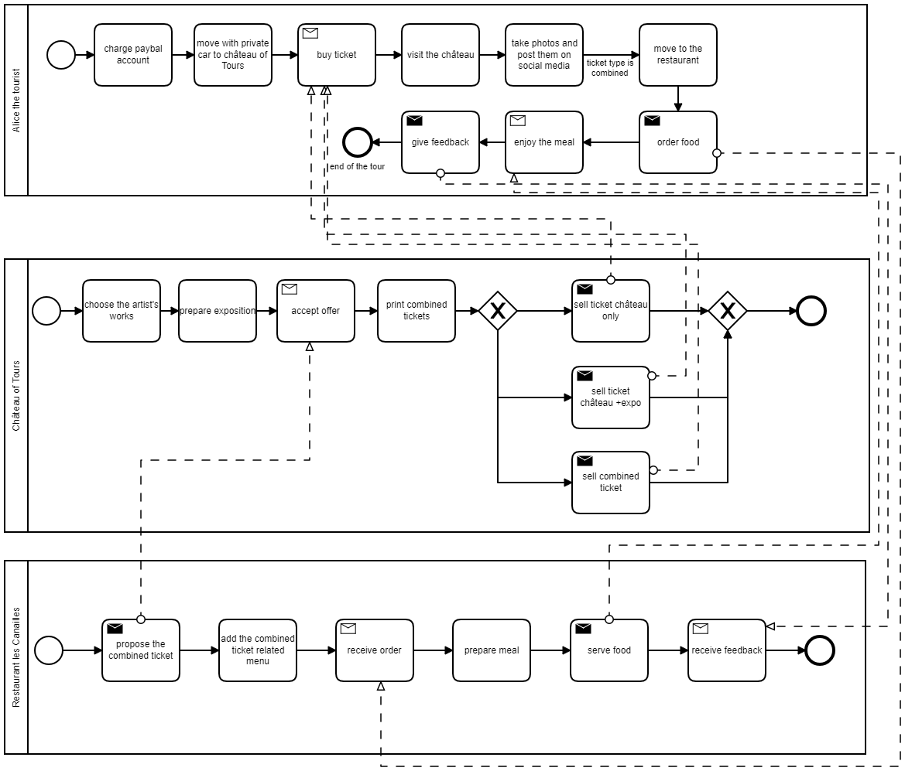

# Create and purchase a combinet ticket on Fabric netwok

## Smart Contracts source code

the smart contracts can be found at SmartContracts/Fabric/InteractionSC/ 

The running example can be found in:

## Fabric network installation guidelines

## Running Application 

-run AutomateSetup/Start.sh to install the sell/buy combined ticket system in smart contract

-to run application on belahalf of the Château of Tours organization, run the following command lines:

 > cd organization/ToursChateau/application
 
 > node addToWallet.js
 
 > node issue.js
 
-to run application on belahalf of the Tourist (Alice) organization, run the following command lines:

 > cd organization/Tourist/application
 
 > node addToWallet.js
 
 > node buy.js
 
 
